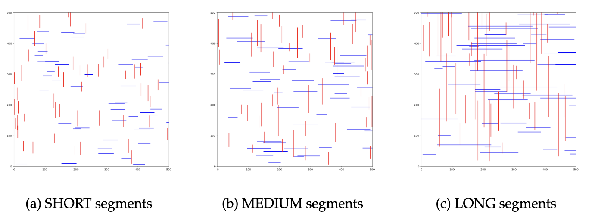

# Plane-sweep for Segment Intersections
Brute-force and plane-sweep algorithms for calculating segment intersections for Geometric Algorithm (Course code: 2IMA15)

## Problem Description
Let $H$ be a set of $n$ horizontal segments in the plane and let $V$ be a set of $m$ vertical segments. The goal of this assignment is to develop and implement a plane-sweep algorithm that counts the number of pairs $(s, s′) \in H \times V$ such that $s$ intersects $s′$. The endpoints of the segments are considered to be part of the segment, so if an endpoint of s lies on $s′$, for example, then $s$ and $s′$ intersect.
The input file describing a problem instance has the following structure.

horizontal segments n
a1 a1' b1 
...
an an' bn
vertical segments m
c1 d1 d1'
... 
cm dm dm'

The first line in the input contains the text horizontal segments and an integer $n \ge 1$ denoting the number of horizontal segments. This is followed by $n$ lines, each specifying a horizontal segment $[a_i, a′_i] \times b_i$, where $a_i, a′_i, b_i$ are integers in the range $[0, 2^{16} − 1]$ such that $a′_i \ge a_i$. After all horizontal segments are specified, the vertical segments are specified in a similar way: there is a line containing the text vertical segments and an integer $m \ge 1$, followed by $m$ lines, each specifying a vertical segment $c_i \times [d_i, d′_i]$, where $c_i, d_i, d′_i$ are integers in the range $[0, 2^{16} − 1]$ such that $d′_i \ge d_i$. The figure below shows an example of an input file.

## Method
Max priority queue to store events, AVL tree to store status, 1d range search

## Evaluation and Result
### Evaluation dataset

This figure shows three generated datasets when $n=50$. Taking the first subplot as an example, its generation parameters are as follows: data_generate(x_range=(1, 500), y_range=(1, 500), segment_length_min=25, segment_length_max=50, num_horizontal=50, num_vertical=50). The second and third subplots have the same parameters as the first one, except that segment_length_max is changed to 100 and 250, respectively.

### Result

The three subplots above represent the results of the SHORT, MEDIUM, and LONG experimental groups, respectively. The three subplots below are enlargements of sections from the above subplots, specifically focusing on the range where $n$ varies from 10 to 250.

- As the number of line segments increases, the running time of the brute-force algorithm grows at a much faster rate compared to the plane-sweep algorithm. Our method significantly outperforms the brute-force approach. 
- By comparing the three subplots above, it is observed that the number of intersections does not significantly impact the running time. This effectively validates our algorithm's time complexity of $O((m+n)log(m+n))$, indicating that it is independent of the number of intersections $k$.
- From the three subplots below, it can be discerned that when the dataset is small, the running time of the brute-force is superior to that of the plane-sweep. However, as the dataset size increases beyond approximately 140, the running time of the plane-sweep algorithm becomes less than that of the brute-force implementation.
- The curves of the brute-force and plane-sweep intersect at a point, indicating that the running times of both algorithms are equal at this juncture. In the SHORT, MEDIUM, and LONG datasets, the x-coordinate of this intersection point is respectively 100, 130, and 140. As the length of the segments increases, leading to more intersections between them, the intersection point of the two curves occurs later.
